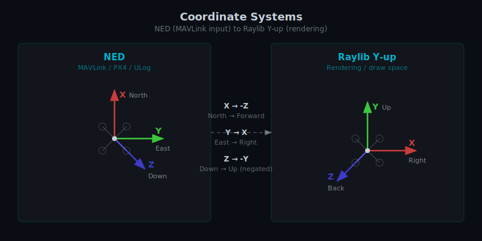

# Coordinate Systems

PX4 and MAVLink use the **NED** (North-East-Down) coordinate convention. Raylib uses **Y-up, right-handed**.
Hawkeye converts between them at the draw layer.

## NED (input)

| Axis | Direction                    |
| ---- | ---------------------------- |
| X    | North                        |
| Y    | East                         |
| Z    | Down (positive below origin) |

## Raylib Y-up (rendering)

| Axis | Direction                |
| ---- | ------------------------ |
| X    | Right                    |
| Y    | Up                       |
| Z    | Back (toward the camera) |

## What this means for users

- **Heading** is displayed as 0° = North, 0–360° clockwise (compass convention).
  This matches navigation convention and what you'd expect from a PX4 HUD.
- **Yaw** (toggled with `Y`) is displayed as ±180°, 0 = forward axis of the vehicle, counter-clockwise positive (math convention).
- **Altitude** shown in the HUD is positive up, in meters above origin.
  The underlying log stores it as NED Z (negative below origin); the HUD flips the sign for intuitive display.
- **Origin altitude** is typically the launch point elevation, not Mean Sea Level (MSL).

## Debug panel coordinates

The X/Y/Z values shown in the debug overlay (`Ctrl+D`) are in Raylib's Y-up draw-space coordinates, not NED.
This is mostly what you want for understanding the rendered scene, but be aware that the Y value is the **altitude**, not the "forward distance" you might expect from an NED-convention tool.
