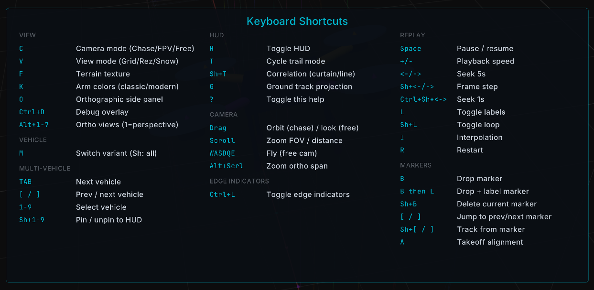

# First run with PX4 SITL

The shortest path from install to seeing a vehicle move.

If you haven't installed Hawkeye yet, see [Installation](./installation.md) first.

::: tip
Press `?` at any time in Hawkeye to open the help overlay with the full keybind reference.
This is the fastest way to discover what the viewer can do.
:::

PX4 publishes prebuilt `.deb` packages and Docker containers for SITL SIH, so you can skip the source build entirely.
Pick whichever fits your setup.

**Terminal 1, option A — Docker (any OS):**

```sh
docker run --rm -it -p 19410:19410/udp px4io/px4-sitl:latest
```

Port 19410 is the SIH display port that Hawkeye binds to.
Add `-p 14550:14550/udp` as well if you also want to connect QGroundControl.

**Terminal 1, option B — `.deb` package (Ubuntu 22.04 / 24.04):**

Download the `.deb` from the [PX4 Releases](https://github.com/PX4/PX4-Autopilot/releases) page, then:

```sh
sudo apt install ./px4_*.deb
PX4_SIM_MODEL=sihsim_quadx px4
```

**Terminal 1, option C — from source:**

```sh
cd PX4-Autopilot
make px4_sitl sihsim_quadx
```

See [Prebuilt PX4 SITL packages](https://docs.px4.io/main/en/simulation/px4_sitl_prebuilt_packages) for the full install reference, other vehicle models, and multi-instance setup.

**Terminal 2, launch Hawkeye:**

```sh
hawkeye
```

A quadrotor appears in the Hawkeye window, sitting at the origin.
In the PX4 shell (Terminal 1), arm and take off:

```
commander takeoff
```

Watch Hawkeye.
The vehicle arms, lifts off, and the HUD numbers at the bottom of the screen update in real time.
Ground speed, altitude, heading, and attitude all flow directly from PX4's MAVLink telemetry.

Left-drag to orbit the camera around the vehicle.
Press `C` to cycle between Chase, FPV, and Free camera modes.
Press `?` at any time to see the full keybind reference, or see [Keybinds](./keybinds.md) for the complete list.



That's it.
You're flying.

## Next steps

- [Live SITL Integration](./sitl.md) — Single-vehicle and multi-instance swarm workflows with PX4 SITL
- [Keybinds](./keybinds.md) — Full keyboard and mouse reference
- [First replay](./first-replay.md) — Replay a `.ulg` file with transport controls
- [First swarm](./first-swarm.md) — Replay multiple logs with deconfliction and correlation
