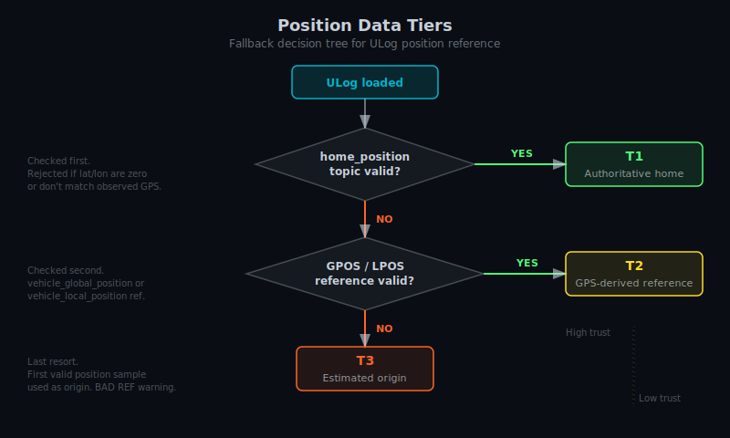

# Position Data Tiers

Not every ULog file contains the same position data.
Some logs have authoritative home position.
Some have only GPS-derived references.
Some have nothing geographic at all.
Hawkeye categorizes each log into one of three tiers based on what it finds.

| Tier   | Source                                                          | Trust level          | Typical use                                                         |
| ------ | --------------------------------------------------------------- | -------------------- | ------------------------------------------------------------------- |
| **T1** | `home_position` topic                                           | High (authoritative) | PX4 logs with clean home set before arming                          |
| **T2** | `vehicle_global_position` or `vehicle_local_position` reference | Medium               | Logs where home was set mid-flight or derived from GPS              |
| **T3** | Estimated origin (first valid position sample)                  | Low                  | Logs missing both home and GPS (indoor flights, optical flow, etc.) |

## How to check the current tier

The tier badge is visible in two places:

- **HUD tier indicator**, a small T1/T2/T3 badge in the Console HUD, colored per tier
- **Debug overlay**, an explicit tier label with full description, shown when `Ctrl+D` is active

## What each tier means for multi-drone replay

- **T1 logs** compare reliably, because all drones share a well-defined geographic reference.
- **T2 logs** compare if the reference points align; if they drift, positions drift too.
- **T3 logs** have no real geographic position.
  Multi-drone replay with mixed tiers produces ambiguous layouts.
  Use the Narrow Grid deconfliction mode to collapse T3 drones into a shared view.

## Known gotchas

- **Zeroed home position**: some logs record a `home_position` topic with zeros for lat/lon/alt.
  Hawkeye treats this as invalid and falls back to T2.
- **Home rejected**: if the pre-scan determines that the recorded home position doesn't match observed GPS data, it's rejected and the log falls through to T2.
  This prevents bad home values from rendering drones at `(0,0,0)` or far from the expected area.
- **BAD REF warning**: shown in the debug overlay if the current reference frame is suspect.
  Usually appears alongside T3 when the estimated origin drifts from observed position data.

## Related

- [Data Sources](./data-sources.md) — Which MAVLink messages and ULog topics feed the tier decision
- [Multi-Drone Replay](./multi_drone.md) — Deconfliction modes for mixed-tier logs
